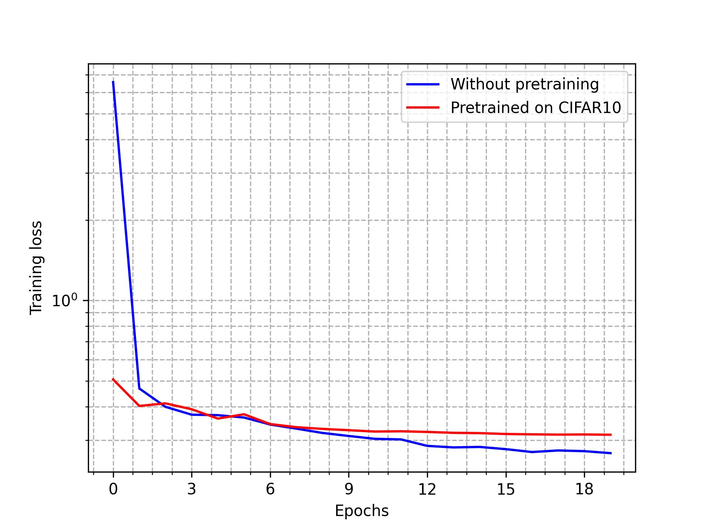

## U-Net for EM Image Segmentation

This project implements a simple U-Net architecture for the ISBI EM image segmentation challenge dataset. 

### Key Features:

- **U-Net Architecture**:  
  Implemented the U-Net architecture for image segmentation, which is commonly used in medical image analysis, particularly in electron microscopy (EM) image segmentation.

- **Performance on ISBI EM Segmentation Dataset**:  
  Achieved **88% pixel accuracy** on the ISBI EM image segmentation challenge dataset.

- **Pretraining on CIFAR-10**:  
  The U-Net model was pretrained on the CIFAR-10 dataset to speed up convergence. While pretraining helped the model converge faster, the accuracy was slightly lower at **84% pixel accuracy** on the ISBI dataset. 
  The training loss curves for both U-Net models are shown below.
  This lower accuracy could be because the CIFAR-10 images are of size 32 x 32, while the ISBI images are of size 512 x 512. CIFAR-10 was chosen due to lack of computational resources.

